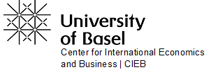

<!-- ```{r setup, include=FALSE} -->
<!-- knitr::opts_chunk$set(echo = TRUE) -->
<!-- ``` -->


<link href="https://stackpath.bootstrapcdn.com/bootstrap/3.3.5/css/bootstrap.min.css" type="text/css" rel="stylesheet">
<link rel="stylesheet" href="style.css" type="text/css" />

<div class="container-fluid main-container">

<!-- <a href="http://cieb.unibas.ch/" target = "_blank">{ width=30% }</a> -->

## **Swiss Pharma in the International Innovation Race--what will the future bring?**

<br>

*December 2020* by <a href="https://wwz.unibas.ch/de/personen/christian-rutzer/" target = "_blank">Christian Rutzer</a>, <a href="https://wwz.unibas.ch/de/personen/matthias-niggli/" target = "_blank">Matthias Niggli</a> and <a href="https://wwz.unibas.ch/de/personen/dragan-filimonovic/" target = "_blank">Dragan Filimonovic</a>


<br>


{width=100%}

Picture: <a href="https://www.flickr.com/photos/stormsworld/8456586910/in/photolist-JfMjzY-Jf3uBk-9HwYDV-ZiCo9F-2jagrVH-HMX3CB-szWiqL-PsKy3L-bRHW5-HbJ87t-mWUYYB-J6PXd-228e7G7-nX4vQD-GAoNUV-AnHZzL-QonY9T-TUXSe1-MynNKE-yoSd93-dwmhsa-WyYCTY-7oFhzy-easv3-4VR2iw-BG4XB8-UkSxzU-ZbG9qo-uYNiyQ-aq6HJV-2gTznUx-3dSjtL-P2g2FQ-8xkuwR-6nJEim-5bA2Ve-5bA2yK-7Xo2QH-8qknKq-5aLf3M-t8HmX-8upbZT-3avCQY-dThdEA-2gaaCH-C2ckEz-5aQ6UU-26Frxpu-bV9qz-57bbjv" target = "_blank">Barry Davis | Flickr</a>

<br>

**ABSTRACT**


The pharmaceutical industry is an important economic pillar for the Swiss Economy and for the region of Basel. Nowadays, the pharma industry accounts for about X percent of employment in the region of Basel and Y percent in Switzerland (link to pharma output). The share of value added is even greater relative to the number of jobs--xx for the Region of Basel and y for Switzerland. The figures show the importance of the pharma industry as a driver of prosperity in Basel and Switzerland. To keep this source of prosperity, it is necessary to be at the forefront in the international innovation race. And this even more so due to the advent of completely new treatment concepts such as Immunotherapy and personalized medicine.

This brings us to the question how the Swiss pharma industry is positioned in the current innovation race. To shed light to this question, we exploit patent data. Usually, pharma innovations are disclosed by patenting in order to guarantee protection from imitators. And numerous studies find that the more often a patent has been cited, the higher is its technological innovation content and economic value [see for example <a href="https://academic.oup.com/qje/article/132/2/665/3076284" target = "_blank">Kogan et al. 2017</a>  or example <a href="https://www.jstor.org/stable/1593752?seq=1#metadata_info_tab_contents" target = "_blank">Hall et al., 2005</a>. For this reason, several studies use the number of highly cited patents to assess the quality of innovations. This criterion can then easily be used to compare the quality of patent portfolios of different countries, regions, or firms. A recent example is the study <a href="https://www.bertelsmann-stiftung.de/de/publikationen/publikation/did/weltklassepatente-in-zukunftstechnologien" target = "_blank">Bertelsmann Stiftung, 2020</a>. 

However, such an assessment has an obvious shortcoming: Since patents are cited over time after their publication, it is only in retrospect possible to assess whether a patent represents an important, even groundbreaking innovation or not. The same problem applies when using this criterion to evaluate a region or country by means of the quality of its patent portfolio. This is unsatisfactory especially from the point of view of decision makers. To tackle this problem, we use machine learning to forecast for each current published pharma patent whether it will be among the 10 percent most cited patents within five years after publication. This is a well-established measure (see ). Technical details can be found at the end of the article in the methodology section. Afterwards we aggregate the forecasts to assess the quality of current published patents of Swiss pharma relative to other major players such as the US, France, or Great Britain and to emerging ones such as China. STARTUPS einfügen

<br> 

### Who will be the top countries in pharma innovations?

As one can see in Figure xy, between 2005 and 2015, the United States and United Kingdom had the largest share of top patents. Swiss pharma has been positioned most times in the upper midfield close to Germany with around 10 percent of its patents being top patents. South-Korea and China have been the ones with the lowest share of top patents among the 15 countries with the most pharma patents (as of year 2000). It is also interesting to see the sharp increase taking place between 2005 and 2015 in Australia, Denmark, and Spain. At the same time, Japan’s share of top pharma-patents has been on a steady decline. That was the past. 

<br>

##### ***Quality of pharma patents at the country level: Past and future***
<iframe width="100%" height=560 frameBorder="0" src='https://cieb.shinyapps.io/cit_pred_ctry/'>
  <p>Your browser does not support iframes</p>
</iframe>
<span style="font-size:0.8em">*Source: Own estimations of the CIEB based on data from the <a href="https://www.uspto.gov/" target ="blank">USPTO</a> and the <a href="http://www.oecd.org/sti/inno/intellectual-property-statistics-and-analysis.htm" target ="blank">OECD</a>.*</span>

Let us now investigate the future. To be able to do so, we have trained different machine learning models allowing us to make a forecast on whether a current published patent will become a top patent. This allows us to predict the share of top pharma patents of a country. To be able to assess the robustness of our predictions, we have trained several machine learning models. When considering the average of all our forecasts, the share of top pharma-patents is likely to decrease strongest in the UK. In contrast, our forecasts show an increase in the share of top patents in the USA. According to our estimates, the USA may in the next years the leader in terms of the share of top patents. We also forecast an increase for Switzerland and a decline for Germany. All in all, currently published Swiss pharma patents seems to be of high quality relative to the patents of most of the other important pharma-countries. It is also interesting to see that China is unlikely to become a major pharmaceutical power soon, at least not based on the relative number of top patents.  

A further important point is that our predictions remain robust when considering different models. This is a good sign, since it indicates that our forecasts tend to be reliable. You can investigate this by yourself by selecting several models at once. 

<br>

### ...and top regions? 

 and Switzerland ...]the Swiss pharma industry has had a lot of high value patents. Moreover, within countries, pharma innovations are very clustered. The clusters of the top innovator countries are ... for the US, Basel for Switzerland etc. It is also interesting to see that China has not a high share of world class patents. 

##### ***Quality of pharma patents at the regional level***
<iframe width="100%" height=560 frameBorder="0" src='https://cieb.shinyapps.io/cit_pred_ctry/'>
  <p>Your browser does not support iframes</p>
</iframe>
<span style="font-size:0.8em">*Source: Own estimations of the CIEB based on data from the <a href="https://www.uspto.gov/" target ="blank">USPTO</a> and the <a href="http://www.oecd.org/sti/inno/intellectual-property-statistics-and-analysis.htm" target ="blank">OECD</a>.*</span>

<br>

### Let's have a look at the firm level

Having looked at the quality of the patent portfolios of different geographical dimensions, we now turn to the company level. We will first look at established big pharma companies. From a Swiss point of view, it is very interesting to see that according to our predictions the quality of Roche's recent patents seems to be better than that of its domestic competitor Novartis. This patter occurs among all of our trained models. It is also interesting to see that in the near past it was the other way round—Novartis has had a larger share of top-patents than Roche. 
If we include other big pharmaceutical companies, our predictions show particularly a strong increase of the quality of the patent portfolios of AbbVie and Pfizer. Accordingly, our forecasts predict that AbbVie could achieve a similar high share of top innovations as was already the case in the early 2000s. On the other hand, our predictions show that a large proportion of Allergan’s, Eli Lilly’s and Novo Nordisk’s patents are unlikely to contain outstanding innovations.

##### ***Quality of pharma patents of the big players***
<iframe width="100%" height=560 frameBorder="0" src='https://cieb.shinyapps.io/cit_pred_ctry/'>
  <p>Your browser does not support iframes</p>
</iframe>
<span style="font-size:0.8em">*Source: Own estimations of the CIEB based on data from the <a href="https://www.uspto.gov/" target ="blank">USPTO</a> and the <a href="http://www.oecd.org/sti/inno/intellectual-property-statistics-and-analysis.htm" target ="blank">OECD</a>.*</span>


Besides considering established pharma players, a look at start-ups may also be interesting. To identify startups, we take an indirect approach. We consider a pharma company to be a startup if it’s first patent application was filed in 2010 or later. Moreover, to find those startups that are likely to be significant in the near future, we only include the ones that have applied for more than 5 patents. So, what about the startups?
As you can see from the Figure, there are some startups whose patent portfolio consists only of top patents, such as TherapeuticsMD from Florida, USA. Based on our estimates, the Swiss start-up Respivant seems also to have a top patent portfolio. It is also interesting to assess the patent portfolio of Moderna, a U.S. pharmaceutical company that is currently making headlines in the media due to the development of a covid-19 vaccine. Our algorithms rate their patent portfolio of very high quality. 

##### ***Quality of pharma patents of startups***
<iframe width="100%" height=560 frameBorder="0" src='https://cieb.shinyapps.io/cit_pred_ctry/'>
  <p>Your browser does not support iframes</p>
</iframe>
<span style="font-size:0.8em">*Source: Own estimations of the CIEB based on data from the <a href="https://www.uspto.gov/" target ="blank">USPTO</a> and the <a href="http://www.oecd.org/sti/inno/intellectual-property-statistics-and-analysis.htm" target ="blank">OECD</a>.*</span>

On the other hand, our algorithms indicate that startups from China, namely Crystal Suzhou, Lianyungang Runzhong, Infinitus, Medshine Discovery, and Shenzhen Rargetrx are not at the innovation frontier. You can see this by selecting these companies in the left selection panel of the figure. Thus, when it comes to startups, the traditional pharma countries, especially the USA, are still at the forefront in terms of high-quality innovations. China, to the contrary, does not really play a role.	


### Concluding remarks

From a Swiss-perspective, it is encouraging to see that our forecasts indicate an increase in the quality of current published Swiss pharmaceutical patents compared to those of the near past. Our forecasts show also that Switzerland has with Respivant a promising startup. Furthermore, and probably not too surprising, US pharma is likely to continue to set the benchmark and may even further expand it's top position regarding high-quality pharma innovations. This is not at least thanks to a number of high-quality startups. At the same time, China is unlikely to play a major role in top innovations in the pharmaceutical industry in the near future. 


<div class="box_div" id="pat_method">	
<p style="font-size:18px">**Predicting the number of citations of a patent**</p>

<details>
  <summary>*Click here to read about our approach*</summary>


</details>
</div>


<br>

**Interested in a comparison** of Swiss pharma with other countries? Then check out our analysis<a href = https://innoscape.ch/en/publications/the-pharmaceutical-industry-a-driver-of-innovation-and-growth-in-switzerland target = “_blank”> The pharmaceutical industry: a driver of innovation and growth in Switzerland</a>.

<div class=bloc_div>
<blockquote>***Open borders are key for high-quality innovations in Switzerland.***</blockquote>
</div>


<br>

**Share this article**
<div class="a2a_kit a2a_kit_size_32 a2a_default_style" data-a2a-url="https://innoscape.ch/en/publications/cross-border-commuting-and-inventions-made-in-switzerland" data-a2a-title="Analysis within Innoscape: Cross-border commuting and inventions Made in Switzerland">
<a class="a2a_button_twitter"></a>
<a class="a2a_button_linkedin"></a>
<a class="a2a_button_xing"></a>
<a class="a2a_button_facebook"></a>
<a class="a2a_button_email"></a>
</div>
<script async src="https://static.addtoany.com/menu/page.js"></script>

<br>

<span style="font-size:0.8em">*This report was written using <a href = https://rmarkdown.rstudio.com/ target = “_blank”>R Markdown</a> and <a href = https://shiny.rstudio.com/ target = “_blank”>R shiny</a>. Calculations to identify cross-border commuting patent inventors were performed at <a href = http://scicore.unibas.ch/ target = “_blank”> sciCORE </a> scientific computing center at the University of Basel. Data and code to reproduce the figures presented in this article are available on <a href= "https://github.com/cieb-unibas/innovation-origins" target="_blank">GitHub</a>.*</span>

<br>
<br>
<br>
<br>

</div>

<!-- Global site tag (gtag.js) - Google Analytics -->
<script async src="https://www.googletagmanager.com/gtag/js?id=UA-71167447-1"></script>
<script>
  window.dataLayer = window.dataLayer || [];
  function gtag(){dataLayer.push(arguments);}
  gtag('js', new Date());
  gtag('config', 'UA-71167447-1');
</script>
